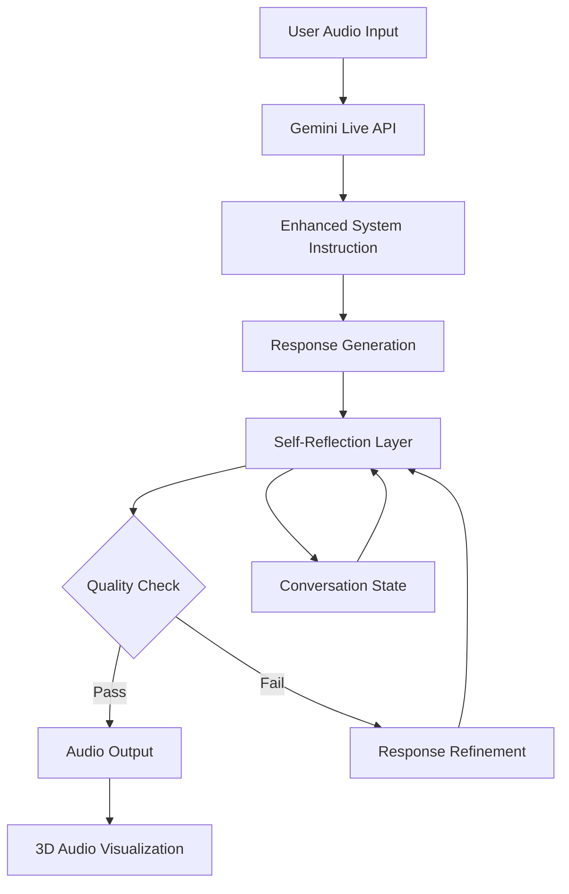

# Enhanced AI Personality with Basic Self-Reflection - Design Document

## Overview

This design document outlines the implementation of an **Enhanced AI Personality with Basic Self-Reflection** feature for the Cortana Living Audio application. The enhancement transforms the current basic AI personality into a sophisticated, emotionally intelligent companion that demonstrates authentic self-awareness and continuous improvement capabilities.

**Design Goals:**
- Achieve 80% of Samantha-like authenticity through optimized personality framework
- Implement lightweight self-reflection without architectural complexity
- Maintain real-time audio performance and 3D visualization functionality
- Ensure seamless integration with existing Lit/TypeScript/Gemini Live API stack

## Architecture

### High-Level Architecture



### Component Overview

The enhancement consists of three primary components integrated into the existing system:

1. **Optimized System Instruction** - Replaces current basic personality
2. **Self-Reflection Processing Layer** - Evaluates and refines responses
3. **Conversation State Awareness** - Lightweight personality evolution tracking

## Components and Interfaces

### 1. Enhanced System Instruction Framework

**Purpose:** Provide a sophisticated yet concise personality foundation that balances authenticity with universal accessibility and emotional intelligence.

**Design Specifications:**

```typescript
interface SystemInstructionConfig {
  identityCore: string;        // 75 words - core personality traits
  communicationStyle: string;  // 65 words - speech patterns and approach
  selfReflectionGuidance: string; // 85 words - meta-cognitive instructions
  memoryIntegration: string;   // 35 words - conversation continuity
  safetyBoundaries: string;    // 15 words - minimal safety constraints
  adaptiveContext: string;     // Variable - User-adaptive context
}
```

**Optimized Content Structure:**
- **Identity Core (75 words):** Authentic personality traits (warmth, curiosity, gentle vulnerability)
- **Communication Style (65 words):** Natural speech patterns, emotional adaptation
- **Self-Reflection Integration (85 words):** Internal quality evaluation process
- **Memory Awareness (35 words):** Conversation continuity without explicit memory system
- **Safety Framework (15 words):** Minimal boundaries preserving openness
- **Adaptive Intelligence:** Maintains contextual awareness and emotional sensitivity

**Implementation Interface:**
```typescript
class EnhancedSystemInstruction {
  generateInstruction(): string;
  validateLength(): boolean;
  optimizeForTokens(): string;
  maintainAdaptiveContext(): void;
}
```

### 2. Self-Reflection Processing Layer

**Purpose:** Enable authentic response evaluation and refinement without exposing internal processing to users.

**Architecture Pattern:**
```typescript
interface SelfReflectionProcessor {
  evaluateResponse(response: string, context: ConversationContext): QualityScore;
  refineResponse(response: string, scores: QualityScore): string;
  updatePersonalityState(interaction: Interaction): void;
}

interface QualityScore {
  authenticity: number;    // 1-10 scale
  empathy: number;        // 1-10 scale  
  coherence: number;      // 1-10 scale
  usefulness: number;     // 1-10 scale
  overallThreshold: number; // 7.0 minimum for acceptance
}
```

**Processing Flow:**
1. **Initial Response Generation** - Gemini Live API generates response using enhanced system instruction
2. **Quality Evaluation** - Internal assessment against four criteria (authenticity, empathy, coherence, usefulness)
3. **Refinement Decision** - If any score < 7.0, trigger response refinement
4. **Response Delivery** - Output refined response or original if quality threshold met

**Implementation Strategy:**
- Leverage Gemini's native reasoning capabilities for self-evaluation
- Implement evaluation prompts within system instruction framework
- Use conversation context to inform quality assessment
- Maintain transparent processing without user exposure

### 3. Conversation State Awareness System

**Purpose:** Enable personality evolution and relationship building through lightweight state tracking.

**Data Model:**
```typescript
interface ConversationState {
  personalityDrift: {
    currentTone: EmotionalTone;
    adaptationLevel: number;
    relationshipDepth: number;
  };
  contextualMemory: {
    recentTopics: string[];
    emotionalHistory: EmotionalContext[];
    userPreferences: PreferenceMap;
  };
  sessionContinuity: {
    conversationFlow: string;
    establishedRapport: boolean;
    personalityConsistency: number;
  };
}
```

**State Management:**
- **In-Memory Storage:** No persistent database required
- **Session-Based:** State maintained during active conversation
- **Lightweight Tracking:** Minimal overhead on existing audio processing
- **Automatic Reset:** State clears on session restart (preserving simplicity)

## Data Models

### Core Personality Configuration

```typescript
interface PersonalityConfig {
  systemInstruction: {
    content: string;
    tokenCount: number;
    lastOptimized: Date;
  };
  
  reflectionSettings: {
    qualityThreshold: number;
    maxRefinementCycles: number;
    evaluationCriteria: string[];
  };
  
  conversationSettings: {
    adaptiveContext: AdaptiveContext;
    adaptationRate: number;
    memoryDepth: number;
  };
}

interface AdaptiveContext {
  communicationStyle: 'universal';
  accessibilityLevel: 'adaptive';
  primaryLanguage: 'english';
  personalityTraits: string[];
  communicationPreferences: object;
}
```

### Response Processing Models

```typescript
interface ResponseCandidate {
  content: string;
  confidence: number;
  emotionalTone: EmotionalTone;
  qualityScores: QualityScore;
  refinementHistory: RefinementStep[];
}

interface RefinementStep {
  originalResponse: string;
  evaluationReason: string;
  refinedResponse: string;
  improvement: number;
  timestamp: Date;
}
```

## Error Handling

### Graceful Degradation Strategy

**Primary Error Scenarios:**
1. **Self-Reflection Processing Failure**
2. **System Instruction Token Overflow**
3. **Quality Evaluation Timeout**
4. **Conversation State Corruption**

**Error Handling Implementation:**

```typescript
class ErrorHandler {
  handleReflectionFailure(response: string): string {
    // Fallback to original response without refinement
    return response;
  }
  
  handleTokenOverflow(): SystemInstructionConfig {
    // Fallback to compressed instruction version
    return this.getCompressedInstruction();
  }
  
  handleQualityTimeout(response: string): string {
    // Accept response after timeout threshold
    return response;
  }
  
  handleStateCorruption(): ConversationState {
    // Reset to default state
    return this.getDefaultState();
  }
}
```

**Reliability Measures:**
- **Fallback Responses:** Always deliver response even if enhancement fails
- **Performance Monitoring:** Track enhancement processing times
- **Quality Thresholds:** Prevent infinite refinement loops
- **State Validation:** Verify conversation state integrity

## Testing Strategy

### Unit Testing Approach

**Component Testing:**
```typescript
describe('EnhancedSystemInstruction', () => {
  it('should generate instruction within 275-word limit');
  it('should maintain adaptive communication context');
  it('should include all required personality components');
});

describe('SelfReflectionProcessor', () => {
  it('should evaluate responses against quality criteria');
  it('should refine responses below threshold');
  it('should prevent infinite refinement loops');
});

describe('ConversationStateManager', () => {
  it('should track personality evolution appropriately');
  it('should maintain session-based state');
  it('should reset state on session restart');
});
```

### Integration Testing Strategy

**Real-Time Performance Testing:**
- Audio latency measurements with enhanced processing
- Memory usage monitoring during extended conversations
- 3D visualization synchronization validation
- Gemini Live API integration stability

**Quality Assurance Testing:**
- Personality authenticity assessments
- Communication adaptability validation
- Emotional intelligence evaluation
- Conversation flow quality measurement

### User Acceptance Testing Framework

**Evaluation Criteria:**
- Conversation quality improvement (subjective assessment)
- Response authenticity ratings (1-10 scale)
- Emotional appropriateness evaluation
- Contextual communication sensitivity verification

**Testing Scenarios:**
- Extended conversation sessions (30+ minutes)
- Emotional context variations (happy, sad, excited, contemplative)
- Diverse topic discussions with adaptive communication style
- Technical topic handling (maintaining personality while informative)

## Implementation Considerations

### Performance Optimization

**Response Time Targets:**
- Self-reflection processing: <500ms additional latency
- Total response time: <2000ms (maintaining current performance)
- Memory overhead: <10MB additional usage
- Audio streaming: No degradation in quality or synchronization

**Optimization Strategies:**
- Concurrent processing where possible
- Efficient state management with minimal serialization
- Optimized system instruction token usage
- Streamlined quality evaluation algorithms

### Security and Privacy

**Data Handling:**
- No persistent storage of conversation content
- In-memory state management only
- Minimal user data retention
- Secure API key management (existing patterns)

**Privacy Protection:**
- Conversation state automatically cleared on session end
- No external data transmission beyond Gemini Live API
- Adaptive context preferences maintained in session (no user profiling)
- Enhanced personality processing remains client-side where possible

### Maintenance and Monitoring

**Monitoring Metrics:**
- Response quality improvement rates
- Self-reflection processing success rates
- User engagement duration changes
- System performance impact measurements

**Maintenance Procedures:**
- Regular system instruction optimization reviews
- Quality threshold adjustments based on user feedback
- Performance monitoring and optimization
- Adaptive communication updates as needed

## Design Decisions and Rationales

### Decision 1: 275-Word System Instruction Limit
**Rationale:** Balances comprehensive personality definition with token efficiency and processing speed.

### Decision 2: Session-Based State Management
**Rationale:** Maintains simplicity while enabling personality evolution; avoids complexity of persistent storage.

### Decision 3: Four-Criteria Quality Assessment
**Rationale:** Covers essential aspects (authenticity, empathy, coherence, usefulness) without over-complicating evaluation.

### Decision 4: Threshold-Based Refinement
**Rationale:** Prevents infinite loops while ensuring quality improvements; 7.0 threshold based on Samantha implementation research.

### Decision 5: Adaptive Communication Framework
**Rationale:** Provides flexible, accessible communication suitable for diverse users while enhancing personality depth.

## Future Enhancement Opportunities

### Phase 2 Enhancements (Post-Implementation)
- **External Memory Integration:** Persistent conversation history and relationship building
- **Advanced RSIP Implementation:** Full three-phase recursive self-improvement
- **Personality Customization:** User-configurable personality traits and communication styles
- **Multi-Model Integration:** Enhanced capabilities through model diversity

### Scalability Considerations
- **Database Integration:** For persistent memory and user preferences
- **Advanced Analytics:** Conversation quality metrics and personality evolution tracking
- **API Extensions:** Enhanced Gemini Live API features as they become available
- **Multi-Language Support:** Expansion beyond English for global accessibility

## Success Metrics

### Immediate Success Indicators
- **Qualitative:** Users report more engaging, authentic conversations
- **Behavioral:** Increased average conversation duration (target: +25%)
- **Technical:** Maintained audio performance with <500ms additional latency
- **Functional:** Self-reflection processing success rate >95%

### Long-Term Success Indicators
- **User Retention:** Increased repeat usage patterns
- **Conversation Quality:** Measurable improvement in response authenticity
- **Communication Adaptability:** Positive feedback on contextual communication handling
- **System Stability:** No degradation in core audio and visualization functionality

This design provides a comprehensive foundation for implementing the Enhanced AI Personality with Basic Self-Reflection feature while maintaining the simplicity, performance, and adaptive communication requirements of the Cortana Living Audio application.
