# Cortana Living Audio - System Architecture

## Overview
This is a real-time voice chat application with 3D audio visualizations powered by Google's Gemini AI. The system enables live audio conversations with AI while providing immersive 3D visual feedback that reacts to both user input and AI response audio.

## System Architecture Diagram

```mermaid
graph TB
    %% User Interface Layer
    subgraph "Frontend UI Layer"
        HTML[index.html]
        CSS[index.css]
        MainComponent[GdmLiveAudio Component]
        Controls[Audio Controls UI]
    end

    %% Core Application Layer
    subgraph "Core Application Components"
        GdmLiveAudio[GdmLiveAudio<br/>Main Component]
        Visual3D[GdmLiveAudioVisuals3D<br/>3D Visualization Component]
        VisualComponent[GdmLiveAudioVisuals<br/>2D Visualization Component]
        Analyser[Analyser Class<br/>Audio Analysis]
    end

    %% Audio Processing Layer
    subgraph "Audio Processing Pipeline"
        InputContext[Input AudioContext<br/>16kHz Sample Rate]
        OutputContext[Output AudioContext<br/>24kHz Sample Rate]
        InputNode[Input Gain Node]
        OutputNode[Output Gain Node]
        MediaStream[Media Stream<br/>Microphone Input]
        ScriptProcessor[Script Processor Node<br/>PCM Data Processing]
        AudioSources[Audio Buffer Sources<br/>AI Response Playback]
    end

    %% AI Integration Layer
    subgraph "Google Gemini AI Integration"
        GenAI[Google GenAI Client]
        LiveSession[Live Audio Session<br/>gemini-2.5-flash-preview-native-audio-dialog]
        RealtimeInput[Realtime Audio Input<br/>PCM Blob Streaming]
        AudioResponse[AI Audio Response<br/>Base64 Encoded Audio]
    end

    %% Utility Layer
    subgraph "Utility Functions"
        Utils[Audio Utils<br/>encode/decode/createBlob/decodeAudioData]
        Base64[Base64 Encoding/Decoding]
        PCMConversion[PCM Audio Conversion<br/>Float32 ↔ Int16]
    end

    %% 3D Rendering Pipeline
    subgraph "3D Graphics Pipeline"
        ThreeJS[Three.js Core]
        Scene[3D Scene]
        Camera[Perspective Camera]
        Sphere[Sphere Mesh<br/>Icosahedron Geometry]
        Backdrop[Backdrop Mesh<br/>Background Environment]
        Renderer[WebGL Renderer]
        Composer[Effect Composer]
    end

    %% Shader System
    subgraph "Shader System"
        SphereShader[Sphere Vertex Shader<br/>Audio-Reactive Deformation]
        BackdropShader[Backdrop Fragment Shader<br/>Gradient Background]
        EXRLoader[EXR Environment Map Loader]
        PMREMGenerator[PMREM Generator<br/>Environment Mapping]
    end

    %% Post-Processing Pipeline
    subgraph "Post-Processing Effects"
        RenderPass[Render Pass]
        BloomPass[Unreal Bloom Pass<br/>Glow Effects]
        FXAAPass[FXAA Anti-Aliasing<br/>Disabled]
    end

    %% Build & Development Tools
    subgraph "Build System"
        Vite[Vite Build Tool]
        TypeScript[TypeScript Compiler]
        LitFramework[Lit Web Components Framework]
        ImportMap[ES Module Import Map]
    end

    %% External Dependencies
    subgraph "External Resources"
        MicrophoneAPI[Navigator MediaDevices API<br/>Microphone Access]
        WebAudioAPI[Web Audio API<br/>Audio Processing]
        WebGLAPI[WebGL API<br/>3D Rendering]
        EXRTexture[EXR Environment Texture<br/>piz_compressed.exr]
    end

    %% Environment & Configuration
    subgraph "Configuration"
        EnvVars[Environment Variables<br/>GEMINI_API_KEY]
        PackageJSON[package.json<br/>Dependencies & Scripts]
        ViteConfig[vite.config.ts<br/>Build Configuration]
    end

    %% Data Flow Connections
    HTML --> MainComponent
    CSS --> MainComponent
    MainComponent --> GdmLiveAudio
    GdmLiveAudio --> Visual3D
    GdmLiveAudio --> Controls

    %% Audio Pipeline Flow
    MicrophoneAPI --> MediaStream
    MediaStream --> InputContext
    InputContext --> InputNode
    InputNode --> ScriptProcessor
    ScriptProcessor --> PCMConversion
    PCMConversion --> Utils
    Utils --> RealtimeInput
    RealtimeInput --> LiveSession

    %% AI Response Flow
    LiveSession --> AudioResponse
    AudioResponse --> Utils
    Utils --> OutputContext
    OutputContext --> AudioSources
    AudioSources --> OutputNode
    OutputNode --> WebAudioAPI

    %% Visual Analysis Flow
    InputNode --> Analyser
    OutputNode --> Analyser
    Analyser --> Visual3D
    Analyser --> VisualComponent

    %% 3D Rendering Flow
    Visual3D --> ThreeJS
    ThreeJS --> Scene
    Scene --> Sphere
    Scene --> Backdrop
    Scene --> Camera
    Sphere --> SphereShader
    Backdrop --> BackdropShader
    EXRLoader --> EXRTexture
    EXRTexture --> PMREMGenerator
    PMREMGenerator --> Sphere

    %% Post-Processing Flow
    Renderer --> Composer
    Composer --> RenderPass
    RenderPass --> BloomPass
    BloomPass --> WebGLAPI

    %% Build System Flow
    TypeScript --> Vite
    LitFramework --> Vite
    ImportMap --> Vite
    ViteConfig --> Vite
    EnvVars --> ViteConfig

    %% AI Integration Flow
    EnvVars --> GenAI
    GenAI --> LiveSession

    %% Real-time Update Loop
    Analyser -.-> SphereShader
    Analyser -.-> Camera
    SphereShader -.-> Sphere
    Camera -.-> Scene

    %% Styling
    classDef uiLayer fill:#e1f5fe,stroke:#0277bd
    classDef coreLayer fill:#f3e5f5,stroke:#7b1fa2
    classDef audioLayer fill:#e8f5e8,stroke:#388e3c
    classDef aiLayer fill:#fff3e0,stroke:#f57c00
    classDef utilLayer fill:#fce4ec,stroke:#c2185b
    classDef renderLayer fill:#e0f2f1,stroke:#00695c
    classDef shaderLayer fill:#f1f8e9,stroke:#689f38
    classDef postLayer fill:#e8eaf6,stroke:#3f51b5
    classDef buildLayer fill:#fff8e1,stroke:#ff8f00
    classDef externalLayer fill:#efebe9,stroke:#5d4037
    classDef configLayer fill:#fafafa,stroke:#424242

    class HTML,CSS,MainComponent,Controls uiLayer
    class GdmLiveAudio,Visual3D,VisualComponent,Analyser coreLayer
    class InputContext,OutputContext,InputNode,OutputNode,MediaStream,ScriptProcessor,AudioSources audioLayer
    class GenAI,LiveSession,RealtimeInput,AudioResponse aiLayer
    class Utils,Base64,PCMConversion utilLayer
    class ThreeJS,Scene,Camera,Sphere,Backdrop,Renderer,Composer renderLayer
    class SphereShader,BackdropShader,EXRLoader,PMREMGenerator shaderLayer
    class RenderPass,BloomPass,FXAAPass postLayer
    class Vite,TypeScript,LitFramework,ImportMap buildLayer
    class MicrophoneAPI,WebAudioAPI,WebGLAPI,EXRTexture externalLayer
    class EnvVars,PackageJSON,ViteConfig configLayer
```

## Component Descriptions

### Core Components

#### GdmLiveAudio (Main Component)
- **Purpose**: Primary application controller managing audio recording, AI communication, and UI state
- **Key Features**:
  - Manages dual AudioContext instances (input: 16kHz, output: 24kHz)
  - Handles microphone access and audio streaming
  - Manages Google Gemini AI live session lifecycle
  - Controls audio recording start/stop/reset functionality
  - Provides UI controls for user interaction

#### GdmLiveAudioVisuals3D (3D Visualization)
- **Purpose**: Creates immersive 3D audio-reactive visualizations
- **Key Features**:
  - Real-time sphere deformation based on audio frequencies
  - Dynamic camera movement responding to audio input/output
  - PBR material rendering with environment mapping
  - Audio-reactive scaling and rotation
  - HDR environment lighting with EXR texture support

#### Analyser (Audio Analysis)
- **Purpose**: Real-time frequency domain analysis of audio streams
- **Key Features**:
  - FFT analysis with 32 sample buffer size
  - Frequency bin data extraction for visualization
  - Separate analysis for input and output audio streams

### Audio Processing Pipeline

#### Dual AudioContext Architecture
- **Input Context**: 16kHz sample rate optimized for speech recognition
- **Output Context**: 24kHz sample rate matching AI response audio
- **Purpose**: Maintains audio quality while optimizing for AI processing

#### Real-time Audio Streaming
- **PCM Processing**: Float32 to Int16 conversion for efficient transmission
- **Chunk-based Streaming**: 256-sample buffer size for low-latency processing
- **Base64 Encoding**: Efficient audio data transmission to AI service

### AI Integration

#### Google Gemini Live Session
- **Model**: gemini-2.5-flash-preview-native-audio-dialog
- **Voice**: Leda (prebuilt voice configuration)
- **Modality**: Audio-only responses
- **Features**:
  - Real-time bidirectional audio streaming
  - Interruption handling for natural conversation flow
  - Automatic audio buffer management

### 3D Graphics System

#### Three.js Rendering Pipeline
- **Scene Management**: 3D scene with sphere and backdrop meshes
- **Post-Processing**: Bloom effects for visual enhancement
- **Shader System**: Custom vertex/fragment shaders for audio reactivity
- **Environment Mapping**: HDR environment textures for realistic lighting

#### Audio-Reactive Animation
- **Sphere Deformation**: Vertex displacement based on frequency data
- **Camera Movement**: Dynamic positioning responding to audio levels
- **Material Properties**: Real-time uniform updates for visual feedback

### Build System

#### Vite Configuration
- **Module Resolution**: ES modules with import maps for browser compatibility
- **Environment Variables**: Secure API key management
- **TypeScript Support**: Full type checking and compilation
- **Development Server**: Hot reload with HTTPS support

## Data Flow Architecture

### Audio Input Flow
1. **Microphone Capture** → MediaStream API
2. **Audio Context Processing** → Web Audio API nodes
3. **PCM Conversion** → Float32 to Int16 transformation
4. **Base64 Encoding** → Efficient data transmission
5. **AI Streaming** → Real-time transmission to Gemini API

### Audio Output Flow
1. **AI Response** → Base64 encoded audio data
2. **Audio Decoding** → Int16 to Float32 conversion
3. **Buffer Creation** → AudioBuffer instantiation
4. **Source Management** → Multiple concurrent audio sources
5. **Audio Playback** → Web Audio API output

### Visual Feedback Loop
1. **Audio Analysis** → Frequency domain analysis
2. **Shader Uniforms** → Real-time parameter updates
3. **Vertex Displacement** → Audio-reactive geometry deformation
4. **Animation Loop** → 60fps rendering with requestAnimationFrame

## Security & Privacy

### API Key Management
- Environment variable configuration
- Build-time injection for security
- No client-side exposure of sensitive credentials

### Microphone Permissions
- User consent required for microphone access
- Secure HTTPS context for media device access
- Proper cleanup of media streams

## Performance Optimizations

### Audio Processing
- Optimized buffer sizes for low latency
- Efficient PCM conversion algorithms
- Proper resource cleanup and memory management

### 3D Rendering
- Optimized geometry with icosahedron subdivision
- Efficient shader compilation and uniform updates
- Post-processing effects with performance considerations

### Real-time Constraints
- 60fps rendering target
- Low-latency audio processing
- Efficient data structure management for concurrent audio sources

## Scalability Considerations

### Component Architecture
- Modular Lit element design for reusability
- Separation of concerns between audio, visual, and AI components
- Event-driven architecture for loose coupling

### Resource Management
- Proper cleanup of audio contexts and media streams
- Efficient texture and geometry management
- Memory-conscious buffer handling

This architecture provides a robust foundation for real-time AI voice interaction with immersive 3D visual feedback, leveraging modern web technologies for optimal performance and user experience.
